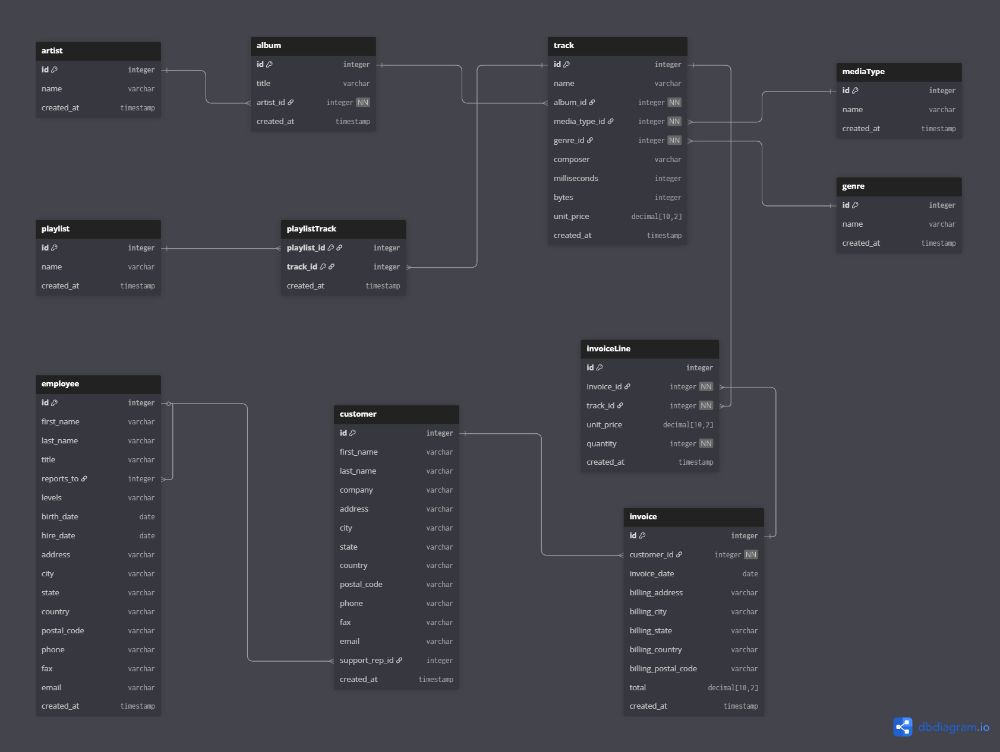

# 🎵 Music_Store_DB_Analysis

A SQL-based analysis project using the Chinook dataset to explore music sales, genres, and customer trends.

## 📂 Files
- `Music Store DB.sql` → Database schema
- `Analysis.sql` → Analytical queries  
- `Music DB Schema.png` → ERD (database structure)  
- `Dataset/` → Source data files  

## ⚙️ Setup
1. Create a new MySQL database.
2. Run `Music Store DB.sql` to load tables.
3. Import csv files provided in the [Dataset](./Dataset/) Folder.
4. Execute queries from `Analysis.sql`.


## 🧱 Schema Diagram



## 🛠️ Database & Tools  
- **Database:** MySQL  
- **Tool:** MySQL Workbench

---

### 4️⃣ Optional: Badges
- Adding badges makes it look polished:

```md
  


## 📊 Results & Key Insights

### 🧑‍💼 Employee Insights
- **Senior-most Employee:** General Manager.

### 💰 Sales & Revenue Insights
- **Top Countries by Invoice Count:** USA and Canada.
- **Top 3 Invoice Totals:** Highest-value transactions identified.
- **Top Earning City:** Ideal location for promotions or events.
- **Best Customer:** Highest-spending customer identified for loyalty programs.

### 🎧 Music & Genre Insights
- **Most Popular Genre:** Rock dominates sales.
- **Top 10 Rock Artists:** These artists contribute the most tracks.
- **Longest Songs:** Mostly instrumental or progressive rock tracks.
- **Most Popular Songs:** Classic Rock and Pop hits lead sales.

### 🌍 Country & Customer Insights
- **Most Popular Countries:** USA, Canada, and Brazil.
- **Top Customer by Country:** Identified for targeted marketing.

### 💿 Genre & Pricing Insights
- **Average Track Price:** Around $1.00 across genres.
- **Spending by Artist:** Rock and Pop artists dominate revenue.

### 🪄 Summary
- 🎸 Rock music dominates sales and artist presence.  
- 💵 USA and Canada are the top markets.  
- 🏙️ High-value cities and customers are prime targets for promotions.  
- 🎧 Average track prices remain consistent globally (~$1).  
